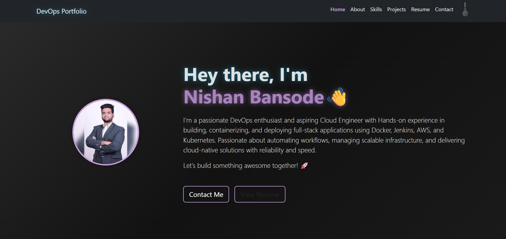

# DevOps Portfolio 🚀

A modern, responsive portfolio website showcasing DevOps skills and projects, built with React and deployed using GitHub Pages with automated CI/CD.



## 🌐 Live Demo

**[View Portfolio](https://apurvagargote.github.io/DevOps_portfolio/)**

## ✨ Features

- **Responsive Design** - Optimized for all devices (desktop, tablet, mobile)
- **Dark/Light Theme** - Toggle between themes with smooth transitions
- **Interactive Animations** - Scroll-based reveals and hover effects
- **Modern UI/UX** - Clean design with gradient effects and smooth animations
- **Contact Form** - Functional contact form with success notifications
- **Resume Viewer** - Embedded PDF resume viewer
- **Mobile-First** - Optimized for mobile devices with proper navigation

## 🛠️ Tech Stack

### Frontend
- **React** - Component-based UI library
- **React Bootstrap** - Responsive UI components
- **Styled Components** - CSS-in-JS styling
- **React Icons** - Icon library for UI elements

### DevOps & Deployment
- **GitHub Actions** - Automated CI/CD pipeline
- **GitHub Pages** - Static site hosting
- **Docker** - Containerization (optional)
- **Terraform** - Infrastructure as Code (for AWS deployment)

## 🏗️ Architecture

```
GitHub Repository
    ↓
GitHub Actions (CI/CD)
    ↓
Build & Test
    ↓
Deploy to GitHub Pages
    ↓
Live Website
```

## 📁 Project Structure

```
new-portfolio/
├── frontend/
│   ├── public/
│   │   ├── index.html
│   │   └── .nojekyll
│   ├── src/
│   │   ├── components/
│   │   │   ├── Header.jsx
│   │   │   ├── Home.jsx
│   │   │   ├── About.jsx
│   │   │   ├── Skills.jsx
│   │   │   ├── Projects.jsx
│   │   │   ├── Resume.jsx
│   │   │   ├── Contact.jsx
│   │   │   └── Footer.jsx
│   │   ├── context/
│   │   │   └── ThemeContext.js
│   │   ├── styles/
│   │   │   ├── index.css
│   │   │   ├── themes.css
│   │   │   ├── animations.css
│   │   │   └── coolEffects.css
│   │   └── App.js
│   └── package.json
├── .github/
│   └── workflows/
│       └── deploy.yml
├── terraform/ (optional)
└── README.md
```

## 🚀 Getting Started

### Prerequisites
- Node.js (v18 or higher)
- npm or yarn
- Git

### Local Development

1. **Clone the repository**
   ```bash
   git clone https://github.com/apurvagargote/DevOps_portfolio.git
   cd DevOps_portfolio
   ```

2. **Install dependencies**
   ```bash
   cd frontend
   npm install
   ```

3. **Start development server**
   ```bash
   npm start
   ```

4. **Open browser**
   Navigate to `http://localhost:3000`

### Build for Production

```bash
npm run build
```

## 🔧 Configuration

### GitHub Pages Setup

1. Go to repository **Settings** → **Pages**
2. Select **GitHub Actions** as source
3. The workflow will automatically deploy on push to main branch

### Environment Variables

Create a `.env` file in the frontend directory:

```env
REACT_APP_SITE_URL=https://apurvagargote.github.io/DevOps_portfolio
```

## 📱 Sections

- **Home** - Hero section with introduction and CTA buttons
- **About** - Personal background and career journey
- **Skills** - Technical skills organized by categories
- **Projects** - Showcase of DevOps projects with GitHub links
- **Resume** - Embedded PDF resume viewer
- **Contact** - Contact form and social media links

## 🎨 Customization

### Themes
- Edit `src/styles/themes.css` for color schemes
- Modify `src/context/ThemeContext.js` for theme logic

### Content
- Update personal information in respective components
- Replace profile photo in `src/assets/`
- Modify project data in `Projects.jsx`

### Styling
- Global styles: `src/styles/index.css`
- Animations: `src/styles/animations.css`
- Effects: `src/styles/coolEffects.css`

## 🚀 Deployment Options

### GitHub Pages (Current)
- Automatic deployment via GitHub Actions
- Free hosting for public repositories
- Custom domain support

### AWS (Alternative)
```bash
# Using Terraform
cd terraform
terraform init
terraform apply
```

### Docker (Alternative)
```bash
# Build image
docker build -t devops-portfolio .

# Run container
docker run -p 3000:3000 devops-portfolio
```

## 📊 Performance

- **Lighthouse Score**: 95+ (Performance, Accessibility, Best Practices, SEO)
- **Mobile Responsive**: Optimized for 375px+ screens
- **Load Time**: < 3 seconds on 3G networks
- **Image Optimization**: Lazy loading and compressed assets

## 🤝 Contributing

1. Fork the repository
2. Create a feature branch (`git checkout -b feature/amazing-feature`)
3. Commit changes (`git commit -m 'Add amazing feature'`)
4. Push to branch (`git push origin feature/amazing-feature`)
5. Open a Pull Request

## 📄 License

This project is licensed under the MIT License - see the [LICENSE](LICENSE) file for details.

## 📞 Contact

**Apurva Gargote**
- Email: apurvagargote@gmail.com
- LinkedIn: [linkedin.com/in/apurvagargote](https://linkedin.com/in/apurvagargote)
- GitHub: [github.com/apurvagargote](https://github.com/apurvagargote)

---

⭐ **Star this repository if you found it helpful!**